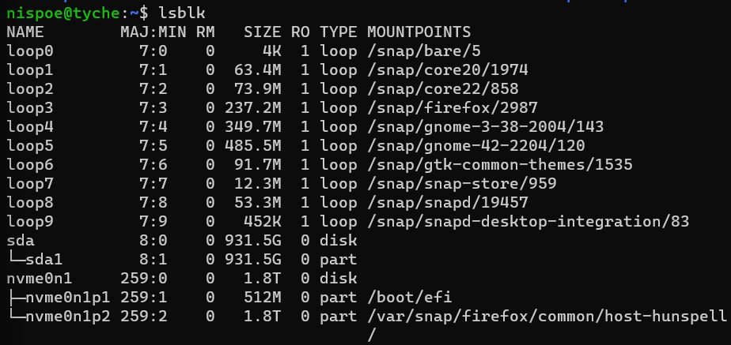
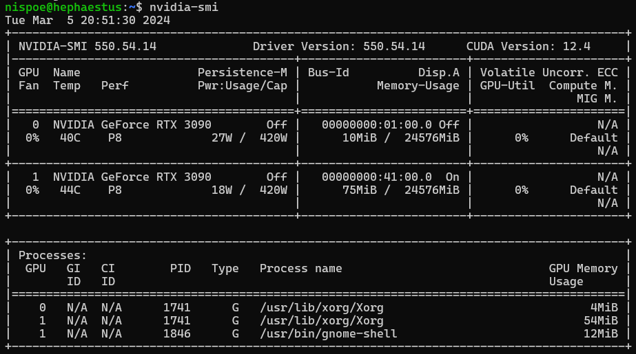
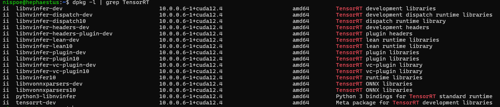
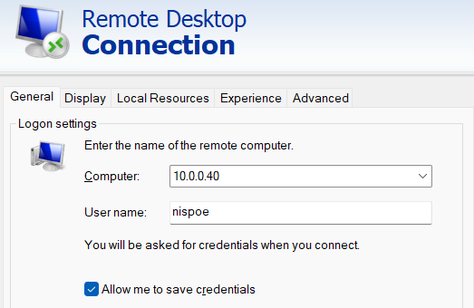

# AI Machine Setup
These are the instructions and steps used to setup the AI experimentation machine used during my doctoral experimentation. Technically hardware can vary and versions will vary over time. These are some of my notes and lessons learned. I named the machine Hephaestus.

## Index
- [Hardware](#hardware)
- [Rufus](#rufus)
- [Operating System](#operating-system)
- [Install network tools](#install-network-tools)
- [SSH to machine](#ssh-to-machine)
- [Update and Ugrade Ubuntu](#update-and-ugrade-ubuntu)
- [Map USBC Drive](#map-usbc-drive)
- [Useful Commands](#useful-commands)
- [Install Git](#install-git)
- [Install Nvidia Driver](#install-nvidia-driver)
- [Install Cuda Toolkit 11.8](#install-cuda-toolkit-118)
- [Install cuDNN](#install-cudnn)
- [Install TensorRT](#install-tensorrt)
- [Setup Jupyter Lab](#setup-jupyter-lab)
- [Monitoring Commands](#monitoring-commands)
- [Suspend Machine](#suspend-machine)
- [Remote Desktop](#remote-desktop)
- [Journal](#journal)

## Hardware
- I made videos while I was constructing the machine
- I put the files on YouTube and I called this my [Hephaestus Build](https://www.youtube.com/playlist?list=PLqL965J4xElJek_JlCG60EOddZZykeb1y)
- Here is a parts list
    - Kingwin KC-8GPU Open Air Case
    - Asus WRX80E-SAGE SE WIFI II
    - AMD Threadripper Pro 5975WX
    - 512 GB Micron 3200 ECC
    - EK-XTOP Revo Dual D5 pump
    - EK-Quantum Magnitude sTRX4 Copper
    - EK X560M and PE 480 radiators
    - Noctua NA-FH1
    - EVGA 1000W T2
    - EVGA 1600W T2 x2
    - Intel Optane P5800X 1.6TB
    - WD_Black SN850X 4TB
    - Two EVGA 3090 GPUs NVLinked
    - Two EVGA 3090 Ti GPUs NVLinked
    - Three Asus 4090 GPUs

## Rufus
- used Rufus 4.4
- ubuntu-22.04.3-desktop-amd64.iso
- These are the settings selected on Rufus

  

## Operating System
- Installed ubuntu-22.04.3-desktop-amd64.iso using rufus and usbc hard drive. This works fast if you have a 10Gbps drive.
    - Ubuntu (safe graphics)
    - Welcome = Install Ubuntu
    - Keyboard Layout = English (US)
    - Updates and other software
        - What apps would you like to install to start with? = Minimal Installation
        - Other options = uncheck all
    - Installation Type = Erase disk and install Ubuntu (3rd option)
    - Where are you? = Chicago
        - Your name = nispoe (enter your own name)
        - Your computer’s name = hephaestus (enter your own name)
        - Pick a username = nispoe (enter your own name)
        - Password = what you normally put
- After install login and open a terminal window in Ubuntu (not remotely)
- Now is a good time to copy over some files from a usb drive
    - copy /usbc/kuk folder to /home/nispoe/kuk
- Install OpenSSH

    ```bash
    sudo systemctl status ssh
    sudo apt -y install openssh-server
    sudo ufw allow ssh
    ```
- Make sure to logout of the machine

## Install network tools
- Install net tools and show ip address may need this to get the IP address of the machine

    ```bash
    sudo apt -y install net-tools
    ip addr show
    ifconfig
    ```

## SSH to machine
- May need to modify known_hosts file C:\Users\nispoe\.ssh and remove network entry to machine (for me this is 10.0.0.32 or 10.0.0.40)
- I used powershell from Windows 11

    ```bash
    cd C:\Users\nispoe\.ssh
    notepad .\known_hosts
    ```

- SSH to the machine by using command in powershell

    ```bash
    ssh nispoe@10.0.0.49
    ```    

## Update and Ugrade Ubuntu
- Update and upgrade

    ```bash
    sudo apt -y update && sudo apt -y upgrade
    ```

## Map USBC Drive
- I have some files I copied over to save time located in a USBC drive under the /kuk directory
- Look for USBC drive

    ```bash
    lsblk
    ```

- Look for something like sda1

    

- Create a directory

    ```bash
    mkdir usbc
    mkdir data
    ```

- Mount the drive

    ```bash
    sudo mount /dev/sda1 ~/usbc
    # may need to unmount if automatically mounted during bootup
    sudo umount '/media/nispoe/Ubuntu 22_04_3 LTS amd64'
    sudo mount /dev/nvme2n1p1 ~/data
    ```
    
- Change directory to mounted drive (most likely don’t need to do this, this is just for reference)
    
    ```bash
    cd ~/usbc
    ```
    
- Copy my main directory over
    
    ```jsx
    cp -r ./kuk ~
    ```
    
- Unmount the drive (leave the drive mounted, this is instruction for just in case you want to unmount)
    
    ```bash
    sudo umount ~/usbc
    ```
    
### Useful Commands
- rsync command
    
    ```bash
    rsync -av --progress ./Praxis/ /home/nispoe/usbc/kuk
    rsync -a --info=progress2 ./Praxis/ /home/nispoe/usbc/kuk
    
    # Backup Commands
    rsync -a --info=progress2 /home/nispoe/kuk/ /home/nispoe/data/kuk
    rsync -a --info=progress2 /home/nispoe/.cache/huggingface/ /home/nispoe/data/.cache/huggingface/
    ```
    
- copy command
    - **`r`**: This option stands for "recursive". When used with **`cp`**, it tells the command to recursively copy directories and their contents.
    - **`f`**: This option stands for "force". When used with **`cp`**, it tells the command to force overwriting of existing destination files without prompting for confirmation.
    
    ```jsx
    cp -rf /media/nispoe/data/kuk ~/kuk
    
    cp -r ~/kuk/brevdev /media/nispoe/data/kuk/brevdev
    cp -r ~/kuk/Praxis /media/nispoe/data/kuk/Praxis
    
    cp -r ~/kuk /media/nispoe/data/kuk
    cp -rf ~/usbc/kuk ~/kuk
    
    cp -rf ~/data/kuk ~
    ```
    
- look at disk usage or folder size
    - **`s`**: This option stands for "summarize". When used with **`du`**, it tells the command to display only a total for each argument instead of showing the size of each subdirectory.
    - **`h`**: This option stands for "human-readable". When used with **`du`**, it tells the command to print sizes in a human-readable format (e.g., kilobytes, megabytes, gigabytes).
    
    ```jsx
    du -sh .
    du -sh ~/kuk
    
    df -h
    ```
    
- difference between folders
    - **`-q`**: This option stands for "brief" or "quiet" mode. When used with **`diff`**, it tells the command to only report whether the files differ, without displaying the actual differences themselves. If the files are identical, no output is produced. If they differ, **`diff`** will display a message indicating that the files differ but won't show the specific changes.
    - **`r`**: This option stands for "recursive". When used with **`diff`**, it tells the command to recursively compare any subdirectories found within the directories being compared.
    - **`s`**: This option stands for "report identical files". When used with **`diff`**, it tells the command to report when two files are identical, in addition to reporting differences.
    
    ```jsx
    diff -qr
    diff -qr ~/kuk/ /media/nispoe/data/kuk
    diff -qr ~/kuk/codellama/ ~/usbc/kuk/codellama/
    diff -qr ~/kuk/PurpleLlama/ ~/usbc/kuk/PurpleLlama/
    ```

## Install Git
- Install Git
    
    ```bash
    sudo apt install git
    ```

## Install Nvidia Driver
- Install the commands after ssh into the machine
- Install using default repository (most times this is what you will do). The latest driver for me was version 535
    - 2024-03-06 - Now installing with 545
    
    ```bash
    apt list --all-versions | grep nvidia-driver
    sudo apt -y install nvidia-driver-545
    ```

- Shutdown may be better to allow you to swap out video cards (1030 card for the 3090 cards)
    - 2024-04-24 - Found if you leave the last (slot7) 4090 can install without problems so reboot would be fine
    
    ```bash
    sudo shutdown -h now
    sudo reboot
    ```
    
- Check Nvidia Card
    
    ```bash
    nvidia-smi
    ```

## Install Cuda Toolkit 11.8
- Install Cuda Toolkit
- Install using what is in repository
    
    ```bash
    sudo wget https://developer.download.nvidia.com/compute/cuda/repos/ubuntu2204/x86_64/cuda-ubuntu2204.pin
    sudo mv cuda-ubuntu2204.pin /etc/apt/preferences.d/cuda-repository-pin-600
    sudo apt-key adv --fetch-keys https://developer.download.nvidia.com/compute/cuda/repos/ubuntu2204/x86_64/3bf863cc.pub
    sudo add-apt-repository "deb https://developer.download.nvidia.com/compute/cuda/repos/ubuntu2204/x86_64/ /"
    
    sudo apt -y install cuda-11-8
    ```
    
    ```bash
    sudo apt -y install cuda
    sudo apt install nvidia-cuda-toolkit
    ```

- Setup paths
    
    ```bash
    echo 'export PATH=/usr/local/cuda-11.8/bin:$PATH' >> ~/.bashrc
    echo 'export LD_LIBRARY_PATH=/usr/local/cuda-11.8/lib64:$LD_LIBRARY_PATH' >> ~/.bashrc
    source ~/.bashrc
    sudo ldconfig
    ```
    
- Reboot
    
    ```bash
    sudo reboot
    ```
    
- Check Nvidia driver and cuda install
    
    ```bash
    nvidia-smi
    nvcc --version
    ```

    

    

- Check if NVLink is connected
    
    ```jsx
    nvidia-smi

    nvidia-smi topo -m
    ```

## Install cuDNN
- Install cuDNN
    
    ```bash
    wget https://developer.download.nvidia.com/compute/cuda/repos/ubuntu2204/x86_64/cuda-keyring_1.1-1_all.deb
    sudo dpkg -i cuda-keyring_1.1-1_all.deb
    sudo apt-get update
    sudo apt-get -y install cudnn
    
    # This is for specific versions use the command above to install the latest
    sudo apt-get -y install cudnn-cuda-11
    sudo apt-get -y install cudnn-cuda-12
    ```

- Reboot machine (wait till after install TensorRT
    
    ```bash
    sudo reboot
    ```
    
- Check CUDNN version
    
    ```bash
    cat /usr/include/cudnn_version.h | grep CUDNN_MAJOR -A 2
    ```

### Install TensorRT
- Using The NVIDIA CUDA Network Repo For Debian Installation
    
    ```bash
    sudo apt install tensorrt
    
    sudo apt install tensorrt-dev
    sudo apt install python3-libnvinfer
    
    dpkg-query -W tensorrt
    ```
    
- Reboot and check
    
    ```bash
    sudo reboot
    
    dpkg -l | grep TensorRT
    ```
    
- May look like this

    

## Setup Jupyter Lab
- Set some path stuff you will need later
    
    ```bash
    echo 'export PATH=/home/nispoe/.local/bin:$PATH' >> ~/.bashrc
    echo 'export TF_ENABLE_ONEDNN_OPTS=0' >> ~/.bashrc
    echo 'export TOKENIZERS_PARALLELISM=true' >> ~/.bashrc
    source ~/.bashrc
    
    export HF_TOKEN=(put your token here)
    wandb=(put your token here)
    ```
    
- Install dependencies
    - 2024-03-09 - These are what I needed specifically for llama2
    
    ```bash
    pip install ipywidgets
    ```
    
- Install some dependencies (install -q -U to make things quiet)
    
    ```bash
    pip install tensorboard
    pip install torchinfo
    pip install torch
    pip install transformers
    pip install bitsandbytes
    pip install -i https://pypi.org/simple/ bitsandbytes
    pip install accelerate
    pip install datasets
    pip install peft
    pip install scikit-learn
    pip install wandb
    pip install tensorflow
    pip install prettytable
    pip install matplotlib
    pip install ipywidgets
    pip install tf-keras
    pip install statsmodels
    ```
- Run jupyter lab
    
    ```bash
    jupyter-lab --ip=0.0.0.0 --port=8888
    ```
    
- Copy jupyter notebook files
    
    ```bash
    sudo mount /dev/sda1 ~/usbc
    
    cp -r ~/usbc/kuk ~
    ```

## Monitoring Commands
- Commands used while monitoring CPU and Nvidia GPU
- CPU (monitor updates frequently)
    
    ```bash
    top
    ```
    
- GPU (monitor and update every 3 seconds)
    
    ```bash
    watch -n 3 nvidia-smi
    ```

## Suspend Machine
- Sometimes I want to suspend a machine
    
    ```bash
    sudo systemctl suspend
    ```

## Remote Desktop
- In Ubuntu Desktop
    - Search for Sharing and find the Remote Desktop toggle button
    - Select Remote Desktop and Remote Control
    - Open a terminal and open firewall
        
        ```bash
        sudo apt -y install xrdp
        sudo systemctl enable --now xrdp
        sudo ufw allow from any port 3389 proto tcp
        ```
        
    - Logout of the machine
- In Windows Desktop
    - Search and open Remote Desktop Connection
    - Type in the IP address 10.0.0.40 (your Ubuntu machine’s IP address) and click he Connect button
    - Make sure to show options and add User name and checkbox ‘Allow me to save credentials’

      

    - When Windows Security comes up select ‘Use a different account’ and then enter a username and password

## Journal
- 2023-05-24 - When using Hephaestus need to install using the EVGA 1030 video card I had laying around. Seems when using other more complex hardware will have problems loading the Ubuntu installer.  
- 2024-05-11 - Have turned off power on 4 3090s, and 2 4090s. Left only the one 4090 at slot 7 on with PSU running and this will allow me to install Ubuntu without any problems.
- 2024-03-05 - Problem with Asus WRX80e motherboard and usb being detected. Fix problem with PCIe (Updated BIOS and Motherboard VGA Switch).
- 2024-03-06 - Turn off the VGA switch on the motherboard, this works with BIOS update.
- 2024-03-06 - https://forum.level1techs.com/t/solved-asus-pro-ws-wrx80e-sage-se-wifi-not-detecting-all-my-nvme-drives-in-proxmox/189373
    - `cd /etc/default/`
    - `vim grub`
    - edit line: `GRUB_CMDLINE_LINUX_Default="quiet"`
    - update to: `GRUB_CMDLINE_LINUX_DEFAULT="quiet pci=nommconf"`
    - Escape button → `:wq`
    - `update-grub`
    - Reboot the machine
- 2024-03-07 - Updated BIOS to version 1302 date 12/08/2023, was version 1106 date 02/10/2023.
- 2024-03-06 - [Nvidia CUDA Toolkit 11.8 Downloads](https://developer.nvidia.com/cuda-11-8-0-download-archive?target_os=Linux&target_arch=x86_64&Distribution=Ubuntu&target_version=22.04&target_type=deb_local) - Location for CUDA Toolkit download
- 2024-03-06 - Installing CUDA toolkit, I was having problems making this work with Nvidia driver 535, it looks like it need version 520
- 2024-03-06 - Installing CUDA toolkit, Problems with 535 so installed 545, this is needed for Cuda Toolkit 11.8 now?